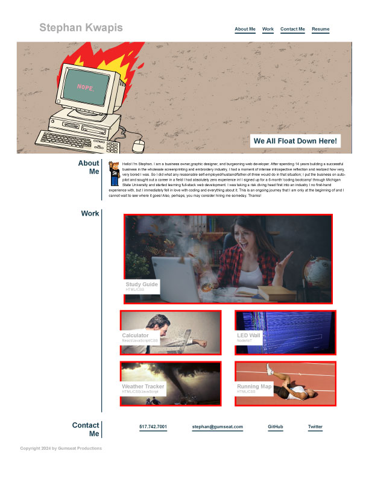

# SDK Basic Portfolio W2C2

SDK Basic Portfolio W2C2 is a web-based portfolio designed to give potential employers, and others, easy access to my present and past work, contact information, and information about me personally.

## Usage

Click the links to view past and present projects I have worked on, as well as to reach out to me through email, phone, and social media.

## Acknowledgements

Images were sourced from Shutterstock. Avatar was created from a 'Code Monkeys' sprite sheet. 

## Visuals

## Contributing

Pull requests are welcome. For major changes, please open an issue first
to discuss what you would like to change.

Please make sure to update tests as appropriate.